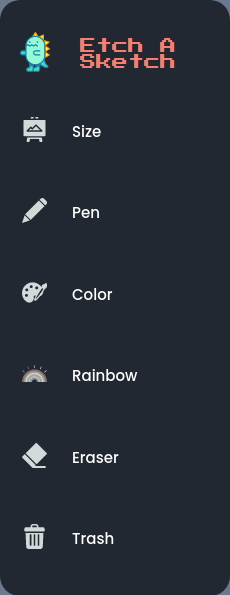

# Etch-A-Sketch

A simple webpage that let users etch a sketch.

**Link To Demo**: https://re-nanashi.github.io/etch-a-sketch/

## Description

A simple beginner webpage that was created using HTML, CSS, and Javascript. It runs renders dynamic elements according to user selection to be used as sketch or drawing canvas. Uses event listeners to inspect mouse functions to draw. This app has functions for clearing canvas, color select, eraser, canvas select, and side bar collapse. Since this a beginner project, it is made to be responsive only to few devices that uses medium to big size screens. No mobile support yet.

### Canvas Select


### Sidebar



### Things that I learned

- Learned some concepts about javascript libraries.
- Learned about CSS grid.
- Learned more about javascript event listeners.

### Things TODO

- Add responsive support for mobile.
- Refactor for a more simpler and understandable structure.

## Development

1. Clone the project <br>
   `git clone https://github.com/re-nanashi/etch-a-sketch.git`

2. Install npm

```
npm install
```

3. Go to directory and run

## Authors

John Reymar I. Fabro(Me)
[@juanfab.af](https://www.instagram.com/juanfab.af/)

## Acknowledgments

Design inspiration, icons, etc.

- [Flat Icon](https://www.flaticon.com/)
